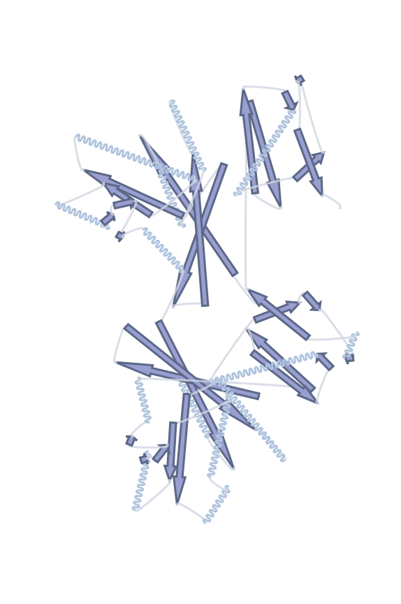
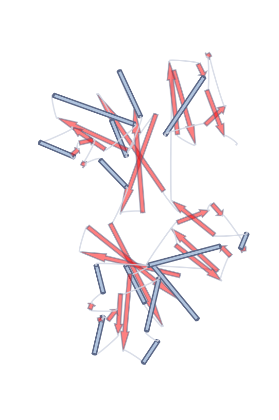
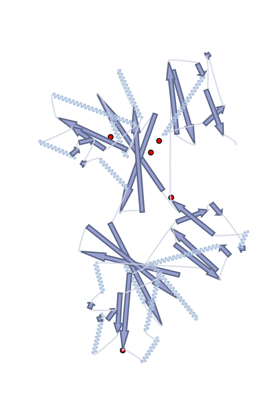
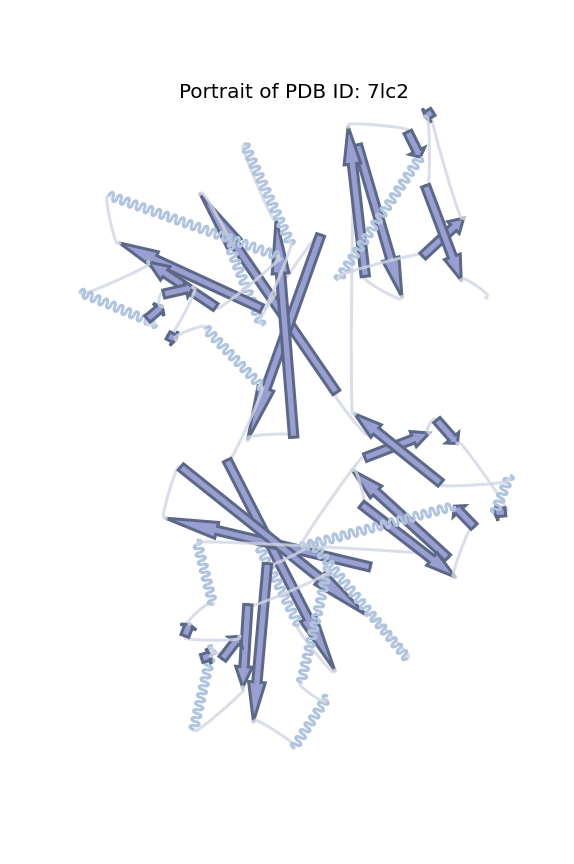
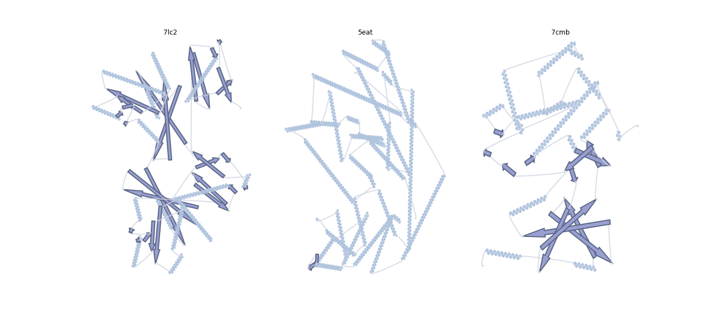

# Portein
## Portraits of Proteins

2D representations of 3D protein structures.

Portein plots secondary structural elements according to the best 2D projection of the input 3D structure. 
(best = greatest area visible)

e.g.

```python
from portein import plot_portrait, PorteinConfig
config = PorteinConfig.default()
plot_portrait("7lc2", config)
```


## Installation
```shell
conda install -c salilab dssp
git clone https://github.com/TurtleTools/portein.git
cd portein
pip install .
```

## How it works

1. Use some linear algebra (from [1](#2dprojection) and [2](#obb)), 
   to find the best 2D projection for the input protein's 3D coordinates. 
2. Run DSSP to split the protein into its secondary structural elements (SSE)
3. Use the start and end coordinates of each SSE to plot (adapted from [3](#sseplot1))
    * helices as waves or cylinders (controlled by `HelixConfig.as_cylinder`)
    * beta sheets as arrows
    * turns as arcs with circles at the ends
    

## Customization
### Configuration

Use the `PorteinConfig` object to modify plotting colors, line widths etc.
```python
from portein import plot_portrait, PorteinConfig
config = PorteinConfig.default()
config.helix.as_cylinder = True # Plot helices as cylinders
config.sheet.color = "red"
config.sheet.opacity = 0.5
plot_portrait("7lc2", config)
```


Available options and defaults:

```python
PorteinConfig(
    helix=HelixConfig(
        as_cylinder=False,
        cylinder_ellipse_length=0.5,
        cylinder_ellipse_height=0.999,
        cylinder_rectangle_height=1.0,
        wave_arc_width=3.0,
        wave_arc_height=1.0,
        wave_arc_length=0.5,
        outline_width=2,
        outline_color='#5c6887',
        color='lightsteelblue',
        opacity=1.0
    ),
    sheet=SheetConfig(
        thickness_factor=1,
        tail_height=1.0,
        head_height=2.0,
        outline_width=2,
        outline_color='#5c6887',
        color='#999FD0',
        opacity=1.0
    ),
    turn=TurnConfig(
        thickness_factor=0.5,
        height=0.5,
        circle_radius=0.2,
        circle_color='#d1d6e3',
        arc_width=2,
        arc_color='#d1d6e3',
        opacity=0.8
    )
)
```

### Plotting
- Use the returned points array to highlight specific residues.
```python
from portein import plot_portrait, PorteinConfig
config = PorteinConfig.default()
ax, points = plot_portrait("7lc2", config)
highlight_residues = [1, 5, 19, 40, 250]
ax.scatter(points[highlight_residues, 0], 
           points[highlight_residues, 1],
           color="red", s=100, 
           edgecolor="black", linewidth=2)
```



- Use the returned ax object to modify the figure
```python
from portein import plot_portrait, PorteinConfig
config = PorteinConfig.default()
ax, points = plot_portrait("7lc2", config, 12)
ax.set_title("Portrait of PDB ID: 7lc2", fontsize=20)
```



- Use the ax parameter for subplots.
```python
from portein import plot_portrait, PorteinConfig
import matplotlib.pyplot as plt
fig, axes = plt.subplots(1, 3, figsize=(18, 8))
config = PorteinConfig.default(outline_width=2)
for ax, pdb_id in zip(axes.ravel(), ["7lc2", "5eat", "7cmb"]):
    plot_portrait(pdb_id, config, ax=ax)
    ax.set_title(pdb_id)
```


---

<a name="2dprojection">1</a>: https://stackoverflow.com/a/2970340 - Optimal rotation of 3D model for 2D projection

<a name="obb">2</a>: https://stackoverflow.com/a/47844156 - Rotating an object to maximize bounding box height

<a name="sseplot1">3</a>: https://gist.github.com/JoaoRodrigues/f9906b343d3acb38e39f2b982b02ecb0 - Protein secondary structure diagrams