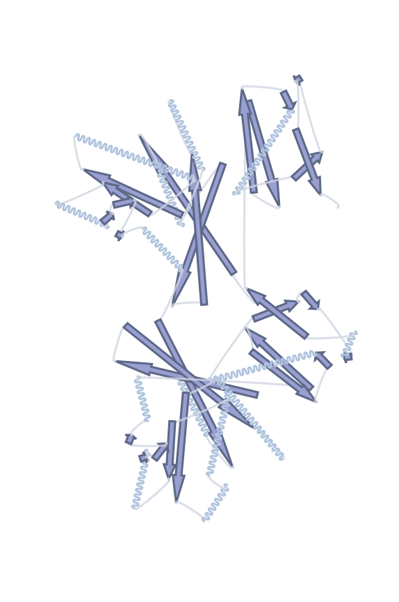
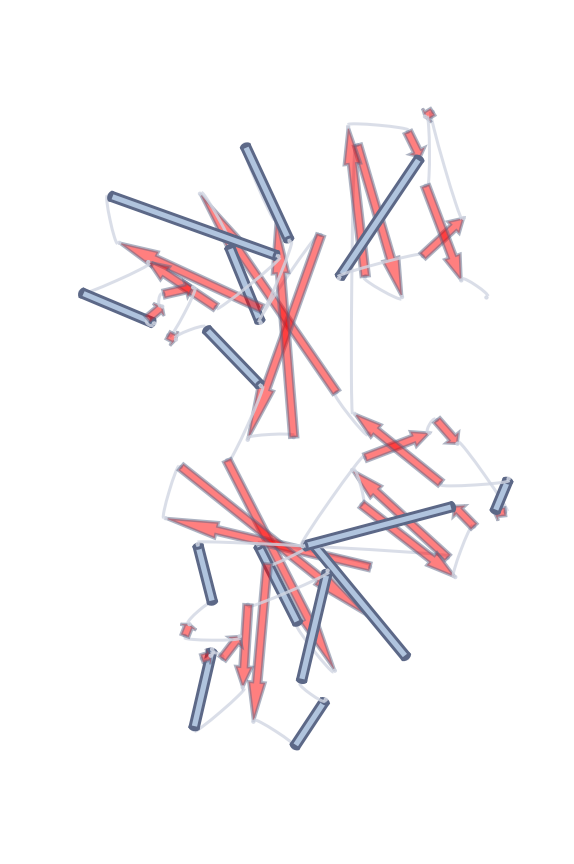
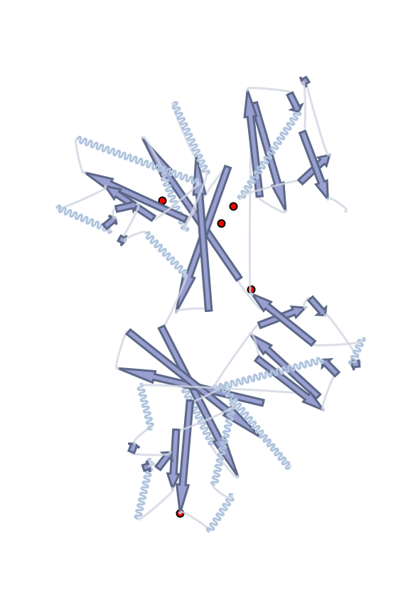

# Portein
## Portraits of Proteins

Plot 2D representations of 3D protein structures.

e.g.

```python
from portein import plot_portrait, PorteinConfig
config = PorteinConfig.default()
fig, ax, points = plot_portrait("7lc2", config)
fig.savefig("7lc2.png")
```


## Installation
```shell
conda install -c salilab dssp
git clone https://github.com/TurtleTools/portein.git
cd portein
pip install .
```

## How it works

1. Use some linear algebra (from [1](#2dprojection) and [2](#obb)), 
   to find the best 2D projection for the input protein's 3D coordinates. 
2. Run DSSP to split the protein into its secondary structural elements (SSE)
3. Use the start and end coordinates of each SSE to plot (adapted from [3](#sseplot1))
    * helices as waves or cylinders (controlled by `HelixConfig.as_cylinder`)
    * beta sheets as arrows
    * turns as arcs with circles at the ends
    

## Customization
- Use the `PorteinConfig` object to modify plotting colors, line widths etc.
```python
from portein import plot_portrait, PorteinConfig
config = PorteinConfig.default()
config.helix.as_cylinder = True # Plot helices as cylinders
config.sheet.color = "red"
config.sheet.opacity = 0.5
fig, ax, points = plot_portrait("7lc2", config)
```

- Use the returned points array to highlight specific residues.
```python
from portein import plot_portrait, PorteinConfig
config = PorteinConfig.default()
fig, ax, points = plot_portrait("7lc2", config)
highlight_residues = [1, 5, 19, 40, 250]
ax.scatter(points[highlight_residues, 0], points[highlight_residues, 1], color="black", size=50)
```

- Use the returned fig and ax objects to modify the final figure.

---

<a name="2dprojection">1</a>: https://stackoverflow.com/a/2970340 - Optimal rotation of 3D model for 2D projection

<a name="obb">2</a>: https://stackoverflow.com/a/47844156 - Rotating an object to maximize bounding box height

<a name="sseplot1">3</a>: https://gist.github.com/JoaoRodrigues/f9906b343d3acb38e39f2b982b02ecb0 - Protein secondary structure diagrams